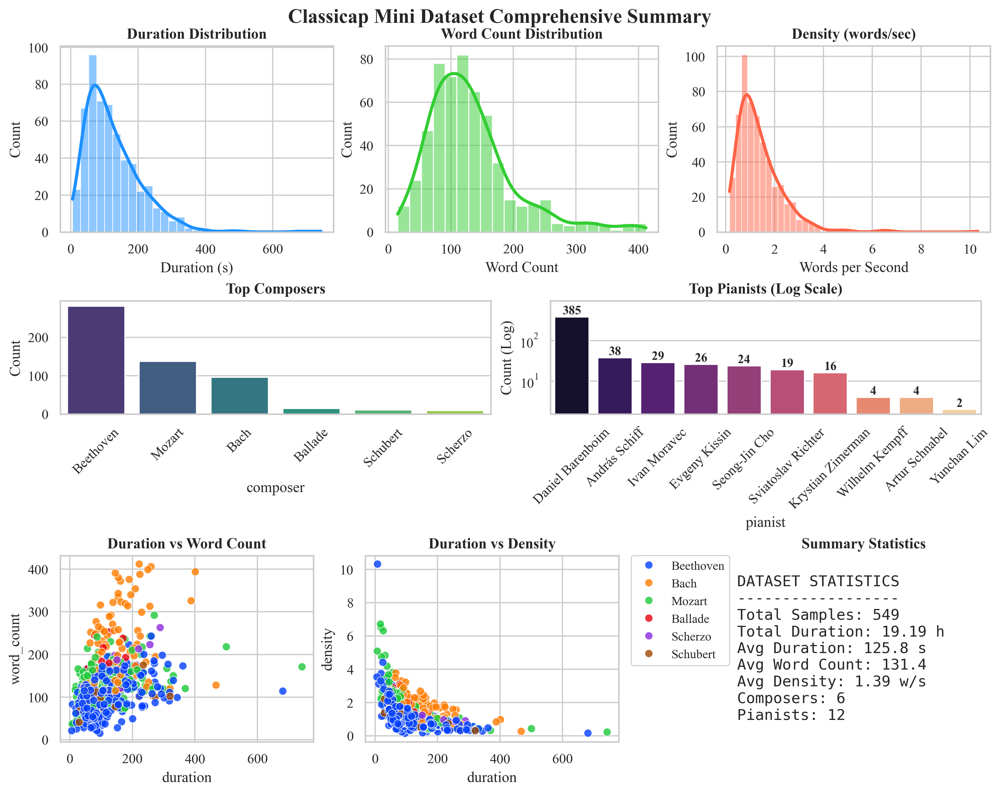

# Classicap Dataset v1.0

A multimodal classical music dataset with 549 piano segments, natural language captions, and theoretical analyses.

## 📋 Overview

- **549 segments** (~19 hours) featuring renowned pianists' performances
- **Main repertoire**: Bach's Well-Tempered Clavier, Piano Sonatas by Beethoven & Mozart, and works by Schubert
- **Audio**: 48kHz stereo WAV (downloadable from YouTube using provided scripts and timestamps)
- **Annotations**: Detailed natural language audio captions + expert theoretical analyses for each segment

## 📝 Annotation Methodology

Annotations were generated using Qwen3-max-2025-09-23 (Alibaba Cloud) based on academic music theory analyses.

- **Audio Captions**: Natural language descriptions of musical content.
- **Theoretical Analyses**: Summaries of harmonic structure and formal design.

## 📊 Dataset Statistics

### Audio Content
- **Total Duration**: 19.19 hours
- **Segment Length**: 125.8s average (median: 104.8s)
- **Repertoire**: 243 movements from 5 composers (Beethoven 51.2%, Mozart 25.0%, Bach 17.5%, Chopin 4.4%, Schubert 2.0%)

### Caption Statistics
- **Total Words**: 72,119
- **Average Length**: 131.4 words
- **Density**: 1.39 words/sec (Range: 0.16 - 10.32)

### Pianists
- **Total**: 12
- **Primary**: Daniel Barenboim (70.1%), András Schiff (6.9%), Ivan Moravec (5.3%)

### Audio Metrics
- **Loudness**: -28.9 dB (±4.6 dB)
- **SNR**: 40.7 dB (±8.2 dB)
- **Dynamic Range**: 21.5 dB (±2.9 dB)
- **Format**: 48 kHz stereo WAV

### Visualizations

See `figures/` for distribution plots.



## 🚀 Quick Start

```bash
pip install -r scripts/requirements.txt
python scripts/download_audio.py --metadata metadata/download_metadata.csv --output audio/
```

*Requires yt-dlp ≥ 2025.10.22.*


## 📁 Structure

```
Classicap_mini_crf_v1/
├── README.md                          # Dataset overview
├── CITATION.md                        # Citation information
├── LICENSE.md                         # License and usage terms
├── metadata/
│   └── download_metadata.csv          # YouTube URLs + timestamps (549 entries)
├── annotation_audio_caption/          # 549 caption files
├── annotation_theoretical_analysis/   # 549 analysis files
├── figures/                           # Statistical visualizations
│   ├── README.md                      # Visualization documentation
│   ├── comprehensive_summary.png      # Overview dashboard
│   └── [7 detailed distribution plots]
└── scripts/
    ├── download_audio.py              # Audio download script
    └── requirements.txt               # Python dependencies
```


## ⚖️ Citation & License

**Citation**: See `CITATION.md`.

**License**: See `LICENSE.md`.
- Annotations: CC-BY-4.0
- Code: MIT
- Audio: User downloads from YouTube

---

**Contact**: happyjunhan@gmail.com  
**Version**: 1.0 (October 2025)  
**DOI**: https://doi.org/10.5281/zenodo.17394078  
**GitHub**: https://github.com/jcjcjuju/Classicap-Dataset
